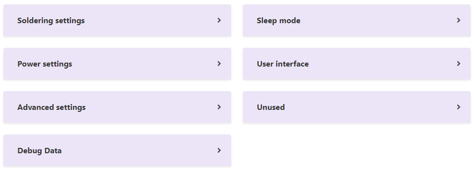

# Settings Categories

- For familiarity, Settings are grouped in a similar way as seen on Pinecil (and as organized in Ralim's IronOS firmware).
- Categories can be clicked to collapse and reduce screen clutter.
- Setting numbers can be changed two ways: moving the slider or simply typing on the box next to the slider.
- Drop-down menus are used for clarity of text choices.
- Toggle choices are used for all check box items ☑️ seen on the pinecil (e.g. detailed idle).

<figure markdown>

<figcaption>Settings categories</figcaption>
</figure>

Full settings view

## Debug Data

- Debug is a special category in Pinecil that is usually hidden and not used unless troubleshooting an issue.
- On Pinecil, the debug menu is accesed by Long hold [-] and then use the [+] to scroll through the values (see here).
- PineSAM currently displays the raw values as sent by the Pinecil and does no change to the values; therefore, these may not match exactly what you see on the Pinecil Debug screen.
- Not all values are available yet, e.g., PD Debug values can only be seen on Pinecil.

## Terminal Script

- a python script runs the backend server inside a terminal (e.g. powershell)
- Terminal messages contain useful information for devs and troubleshooting.
- BLE MAC address of the pinecil for example is on line "Found pinecil at" `C4:xx:xx:xx:xx:xx`

